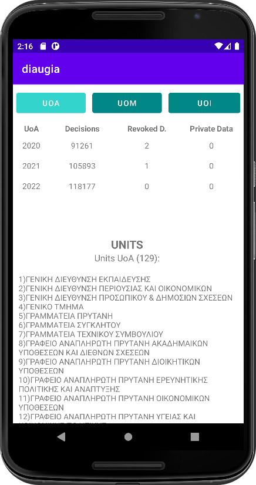

# diaugeia-android-app

<h4>Diaugia is an android application that makes API calls from <a href="https://diavgeia.gov.gr/"><b><i>diavgeia.gov.gr</i></b></a> and displays results for 3 Greek Universities:</h4>
<ol>
  <li><i>University Of Athens</i></li>
  <li><i>University Of Macedonia (Thessaloniki)</i></li>
  <li><i>University of Ioannina</i></li>
</ol>

<h4>It shows number of decisions, revoked decisions, private data of revoked decisions a University did in 2020, 2021 and 2022. 
  It, also, displays the Units size of each University and the content of Units.</h4>
  

This app was created for the purpose of coursework in "E-Governence" course of University of Macedonia (Applied Informatics - UoM, 2022, 7th Semester)

<h4> Our team (Team 4) consists of the following students:</h4>
<ul>
  <li><b><i>Ampatzidou Elisavet</i></b></li>
  <li><b><i>Dasyra Evmorfia - Elpida </i></b></li>
  <li><b><i>Ouzounidis Kyriakos</i></b></li>
</ul>

<h2>Results - Screenshots </h2>

  <b>
Results for University of Athens:
</b>
    
  <b>
Results for University of Macedonia:
</b>
    
  <b>
Results for University of Ioannina:
</b>
  

