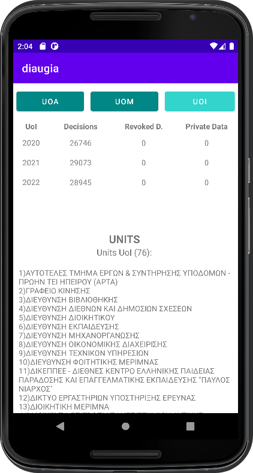

# diaugeia-android-app

<h4> Diaugia is an android application that was created for the purpose of coursework in "E-Governence" course of University of Macedonia (Applied Informatics - UoM, 2022, 7th Semester)</h4>

This app makes API calls from <a href="https://diavgeia.gov.gr/"><b><i>diavgeia.gov.gr</i></b></a> and displays results for 3 Greek Universities:

<ol>
  <li><i>University Of Athens</i></li>
  <li><i>University Of Macedonia (Thessaloniki)</i></li>
  <li><i>University of Ioannina</i></li>
</ol>

It shows number of decisions, revoked decisions, private data of revoked decisions for years 2020, 2021, 2022. This app, also, displays the Units size of each University and the content of Units.

<h4> Our team (Team 4) consists of the following students:</h4>
<ul>
  <li><b><i>Ampatzidou Elisavet</i></b></li>
  <li><b><i>Dasyra Evmorfia - Elpida </i></b></li>
  <li><b><i>Ouzounidis Kyriakos</i></b></li>
</ul>

<h2>Results - Screenshots </h2>

  <b>
Results for University of Athens:
</b>
    
  <b>
Results for University of Macedonia:
</b>
    
  <b>
Results for University of Ioannina:
</b>
  

